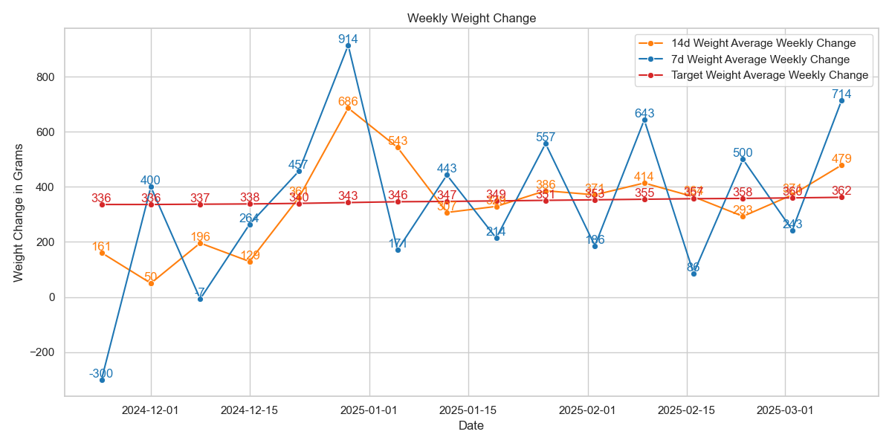

# Garmin Weight Analysis for Bulking and Cutting
Tracking your weight effectively is crucial when bulking or cutting.
Whether your counting calories or not, your weight is the most direct and honest feedback on your progress.
You need to be aware of how your weight is changing over time to adjust your diet and exercise routine accordingly.
This repository helps you track your weight more effectively and compare it to your targeted weight change rate.
It's focused on helping you bulk or cut more effectively by providing you with actionable insights based on your weight data.

While a lot of applications (e.g., Garmin Connect) provide rudimentary tools for tracking your weight,
they often lack the flexibility and depth needed to effectively track your weight for bulking or cutting effectively:
- They often only provide limited and unsuitable time ranges for weight averages (e.g., last day, 7 days, 4 weeks, year).
- They often lack the ability to compare your weight change to optimal [bulking rates](https://macrofactorapp.com/bulking-calculator/) or [cutting rates](https://macrofactorapp.com/cutting-calculator/).
- They don't provide you with actionable insights to get you on track for hitting your bulking or cutting goals.

## Features
- **Download Weight Data**: Download your raw weight data from Garmin Connect using the [garminconnect](https://pypi.org/project/garminconnect/) package.
- **Weekly and Two-Weekly Averages**: Calculate weekly and two-weekly averages of the weight data to smooth out daily fluctuations.
- **Weight Change per Week**: Calculate the weight change per week based on the weekly and two-weekly averages, respectively. This correspond to your bulking or cutting rates.
- **Targeted Weight Change Rate**: You can specify your targeted weekly weight change rate (percentage) for bulking (positive) or cutting (negative) in the `.env` file.
- **Actionable Insights**: Calculate the daily weights you need to hit to reach your targeted weekly weight change rate.
- **Plotting**: Plot three different plots of your weight data: absolute weight, weight change per week compared to your targeted weight change rate, and daily weight targets.

## Examples

### Weight Data Overview
The following plot shows an example of the weekly and two-weekly averages of the weight data. The red line represents the weekly average, and the green line represents the two-weekly average.

[](docs/images/weight_overview_example.png)

### Weight Change per Week
The following plot shows an example of the weight change per week based on the weekly and two-weekly averages. The red line represents the targeted weight change rate. The blue line represents the weekly weight change rate, and the orange line represents the two-weekly weight change rate.

[](docs/images/weight_change_example.png)

### Weekly Overview & Daily Targets
The following plot shows an example of the weekly overview and daily targets. The blue line shows the weekly weight average (including the target for the week) and the orange line shows the raw daily weights. The red line indicates the raw daily weights you need to hit to reach your targeted weekly weight change rate.

[](docs/images/weekly_overview_example.png)

## Installation
This repository uses poetry for dependency management.
To install the dependencies, run the following command:
```bash
poetry install
```

## Usage
You need a Garmin account with weight data to use this repository.

To use the code, you need to create a `.env` file in the root directory of this repository.
The `.env` file should contain the following variables:
```bash
GARMIN_USERNAME=<your_garmin_username>
GARMIN_PASSWORD=<your_garmin_password>
```

After creating the `.env` file, you can run the code with the following command to download the weight data:
```bash
poetry run python scripts/download.py
```

This stores the weight data in a file called `weight.json`.

Using this data, you can then process the weight data with the following command:
```bash
poetry run python scripts/process.py
```

If you want to send the plots to your email, you can add the argument `--send` to the command:
```bash
poetry run python scripts/process.py --send
```

You can specify your targeted weekly weight change rate for bulking (positive) or cutting (negative) in the `.env` file:
```bash
TARGET_WEEKLY_CHANGE_PERCENTAGE=<your_targeted_weekly_change_percentage>
```

For example, if you want to gain 0.5% of your body weight per week, you can set the following variable:
```bash
TARGET_WEEKLY_CHANGE_PERCENTAGE=0.005
```

To run everything in one go, you can use the following command:
```terminal
/bin/bash run.sh
```

For settings up the email sending, you'll need to create a webhook (e.g., using [Make](https://make.com)) that takes the inputs and sends them to your email. If you don't use make you might have to adjust the code. The following environment variables need to be set for the email sending to work:
```bash
WEBHOOK_URL=<your_webhook_url>
MAKE_API_KEY=<your_make_api_key>
EMAIL=<your_email>
```
